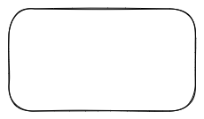

# Development guides



## Repository organization

```bash
├── handlers
├── keyboard
├── main.py
├── middleware
├── models
├── services
├── settings.py
├── settings.yml
├── templates.py
├── ui_commands.py
└── utils

```


## Scheduler 

Bot allows to send notification with regular schedule. Every 4 hours.

## Authorization

Bot uses Aiogram middleware for 

for authorization 

## SQLAlchemy 